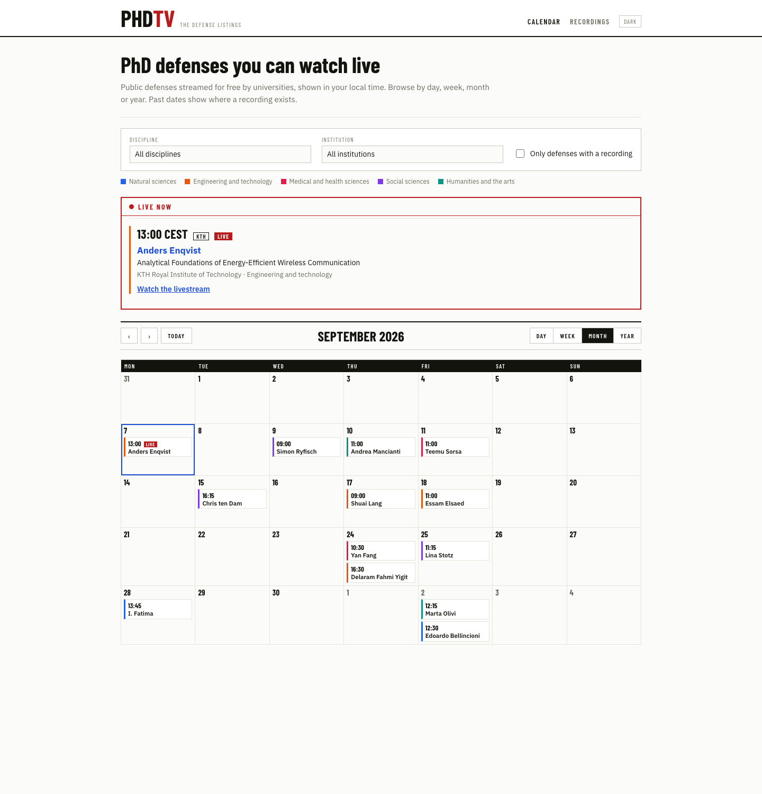
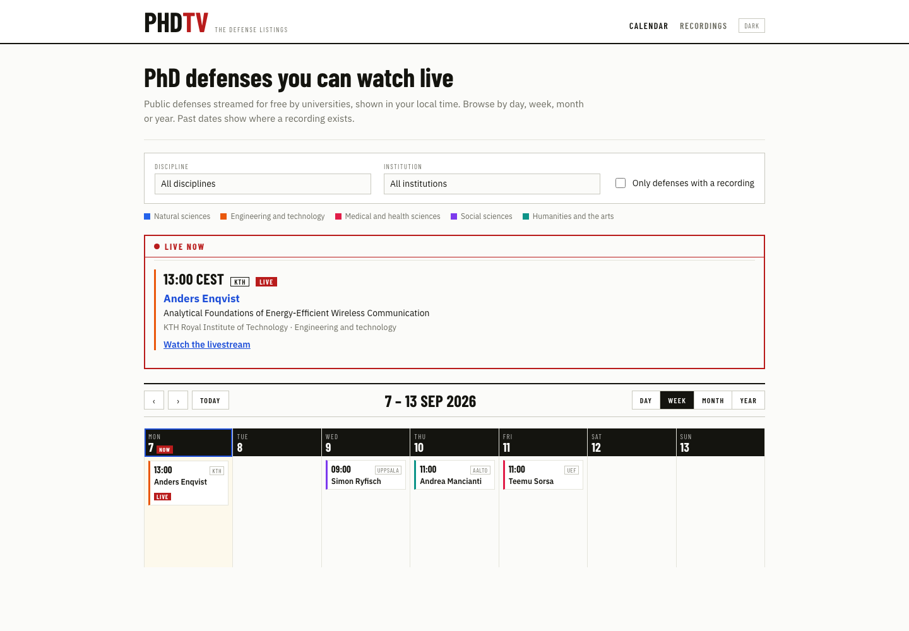
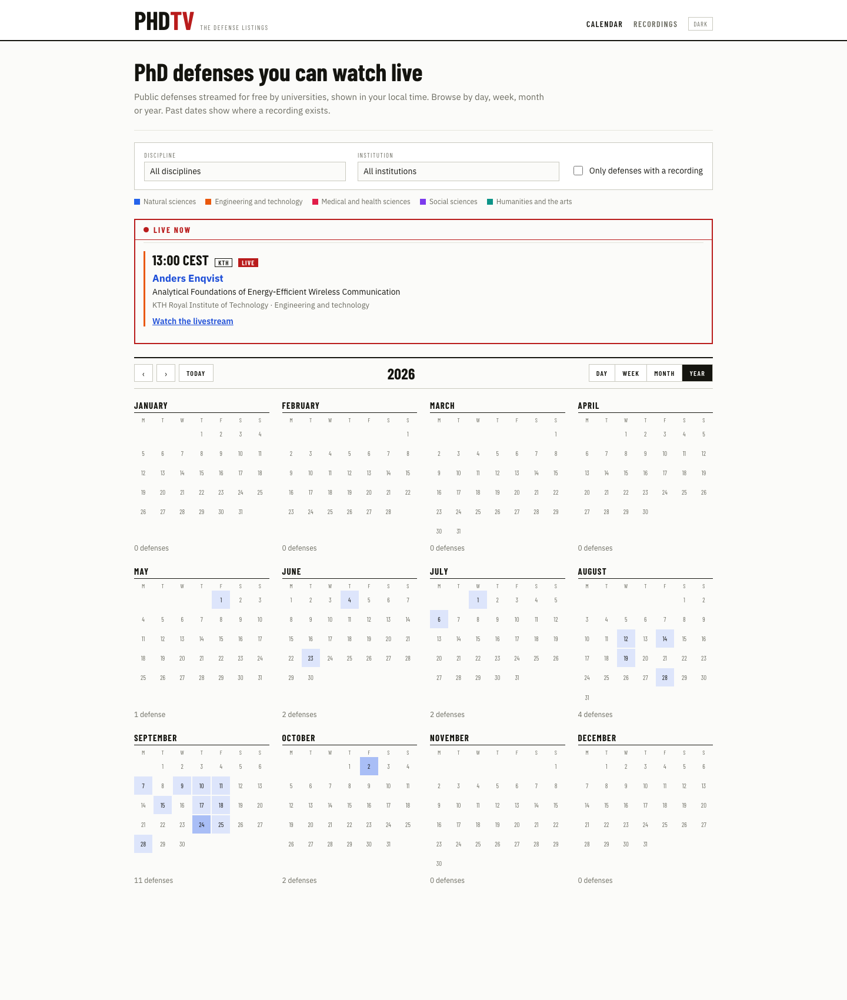
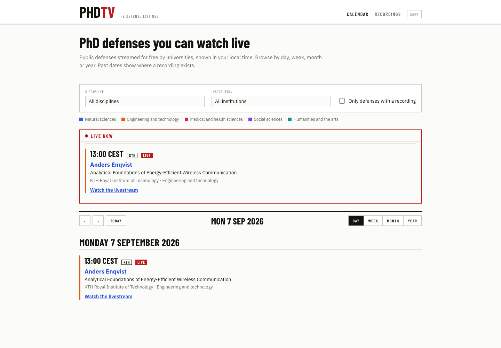
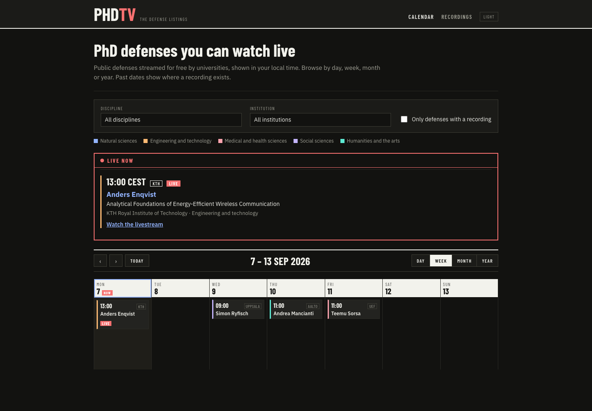
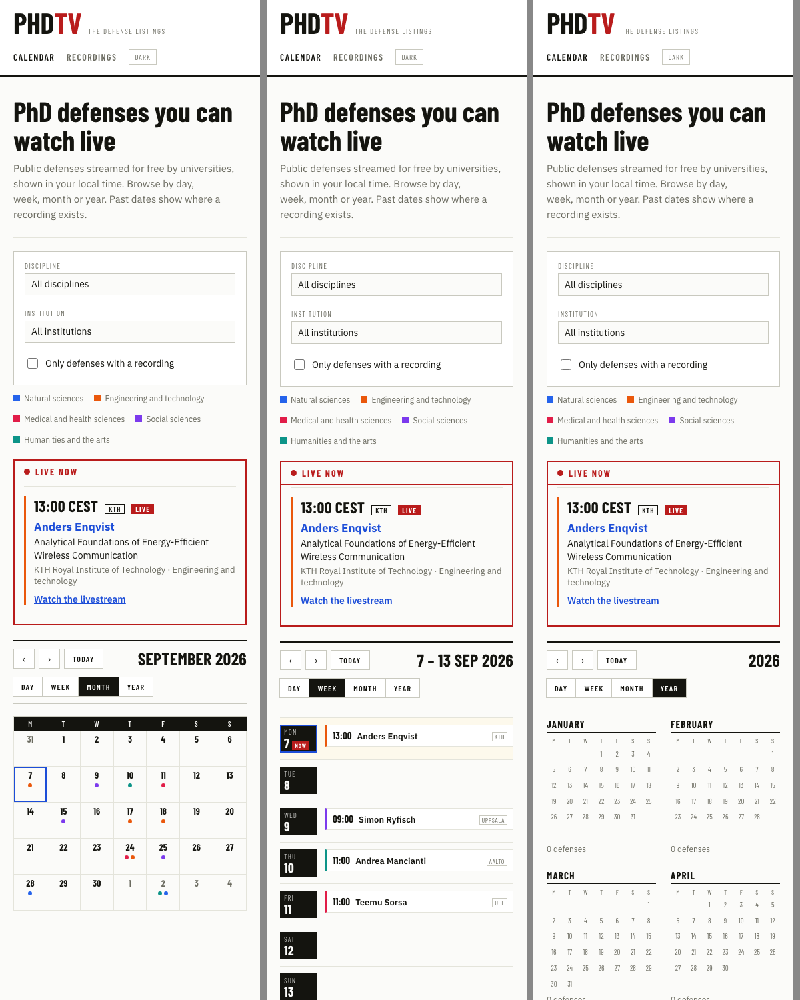

## What changed

The user asked for the defense list to become a calendar with day, week, month and year views, so that a visitor gets not only the details of each defense but a sense of when things are coming up and how dense the schedule is. They asked to be interviewed about the open questions rather than handed a design. This entry records what the interview settled and why, and the prototype that followed. No code changed; the spec lives at `docs/superpowers/specs/2026-09-06-calendar-views-design.md`.

The decisions, in the order they were taken:

| Question | Decision |
| --- | --- |
| The Upcoming and Archive pages | One calendar for everything. Future dates show stream status, past dates show recording status. The archive becomes a redirect to the year view with the recordings filter on. |
| Default view | Month, anchored on today. |
| Clicking a compact item | Goes to the existing defense page. No popover. |
| Week layout | Seven columns of stacked chips, not a Google-Calendar time grid. |
| Month cell | One chip per defense: start time and candidate. |
| Year layout | Twelve mini-months with day cells shaded by count, a wall-calendar page. |
| Chip colour | Left border coloured by the discipline's OECD major field, with a legend. |
| How to build it | By hand. No calendar library, no date library. |

## Why it matters

This is the first change to the site's shape since it went live yesterday, and it changes what the front page is for. The list answered "what is next"; the calendar has to answer "what is next", "how busy is October" and "what did I miss in June" from the same screen. The archive page dissolves into a filter because a calendar that could only move forward would be strange, and a recording is just what a past cell shows.

The library question mattered more than usual. FullCalendar or react-big-calendar would have brought several hundred kilobytes, browser-only rendering that empties the no-script fallback, and stylesheets to fight, all to produce views that are not the ones chosen: stacked chips and shaded mini-months are not what those libraries ship. The whole project is TypeScript and React with no framework layer, and a calendar grid is a few dozen lines of date arithmetic, so hand-building keeps that shape.

## How it works

The design is in the spec; three points are worth pulling out because they took the most thought.

**Time zones move from a label to a placement problem.** The list showed institution time first and viewer time alongside. In a grid, the zone decides which cell a defense sits in: a 00:30 Amsterdam defense is on the previous day in New York. After hydration everything is grouped by the visitor's local date, today is the visitor's today, and chips show the visitor's time with the institution's in the tooltip. Before hydration, which is the build output and the no-script fallback, there is no visitor, so each defense sits on its institution-local date, the date in the record's filename, and the static page agrees with the feeds. The hand-over uses the same first-render-matches-server pattern the schedule island already has.

**Sparse data shaped the views more than the calendar metaphor did.** Twenty-two records across six months means most weeks are empty and no day exceeds two. That ruled out the time grid, whose whole area would be blank, and it made the empty state the common case: an empty week or month shows "Previous: Fri 28 Aug" and "Next: Mon 7 Sep" links that jump to the nearest defense under the current filters, so nobody pages through blank months. The year view exists mostly to make that density visible at once.

**Filters are applied before anything is counted.** Discipline, institution and recordings-only run first, then grouping, then rendering. A month's chips, a year's shading and counts, and the jump links all describe the same filtered set, which is what makes the filters feel like they apply to every view rather than to a list behind it.

Everything the island knows is in the URL: `view`, `date` and the three filter parameters, written with `replaceState` as the filters are today, so a link reopens the same screen and the back button returns to it from a defense page.

## The prototype

Before implementation the user asked for a prototype in Claude Design, driven from this session through the Chrome extension, and mid-way asked that it reflect the aesthetics of a TV guide. The brief was the spec condensed to a page, all twenty-two real defenses as sample data, and a fixed "now" of Monday 7 September 2026 at 13:20 so that one defense is live. The look section asked for listings-magazine and programme-guide cues, institutions treated like channels, and no CRT kitsch.

The first version came back in about four minutes: Barlow Condensed headings over IBM Plex Sans, a "PHDTV · The defense listings" masthead, ruled grids, colour-striped chips, the live strip, dark mode, and a phone layout that turns month chips into dots. It was faithful to the spec and readable, but the TV flavour was mild, the year view's captions drifted where a month needed six rows, the day view printed its date twice, and the Recordings link opened August instead of the year view. Five adjustments went back and landed in three minutes: inverted header bars with a red NOW tag on today, the institution badge on the time line like a channel tag, six rows in every mini-month, a spelled-out day heading, and the Recordings link fixed.

The prototype file and the small runtime used to render it are alongside the images in `blog/media/2026-09-06-01-calendar-views-designed/`. The project itself is "PhD TV calendar prototype" in the user's Claude Design account.

## What's next

Two decisions before code. First, whether the TV-guide look carries into the implementation: the spec's look section still describes the site's current quiet styling, and the prototype's masthead, condensed type and inverted header bars would replace it. Second, the user reviews the spec file. Then an implementation plan, then the work: a pure `src/lib/calendar.ts` on `YYYY-MM-DD` strings, one component per view, a chip component, a legend, the major-field slug added to the defense view-model, an optional `short_name` on universities for chip labels, and the CSS, which is most of the effort. The schedule island and its tests go away.

> **Update 2026-09-06**: all of this landed the same day, including the TV-guide look — the spec's Look section was rewritten around the third round before the stylesheet task ran. See [The calendar lands](2026-09-06-03-calendar-views-landed.md).

## Surprises

Two ASCII sketches did the work a mockup tool would have. The user declined the browser-based companion and picked layouts from monospace previews inside the questions; the week and year sketches were enough to make the time-grid and heat-strip alternatives look wrong at a glance.

The colour question went the other way from the recommendation. Uniform chips were proposed as the simpler default; the user chose colour by major field, which revives the deferred "second taxonomy level in the UI" thread from the notebook in a form nobody had proposed: the six OECD majors as a legend rather than a filter.

Seeing the prototype was harder than making it. The Claude Design page never reaches the idle state the Chrome extension waits for, so screenshots time out; the preview iframes carry signed tokens the extension redacts; the system screenshot tool returns black without a permission the session cannot grant; and the downloaded file is not plain HTML but Claude Design's own `.dc` template format, with `sc-if` and `sc-for` directives and a logic class that expects a runtime that does not ship with it. The way through was a ninety-line runtime of our own, `build-runtime.js`, that resolves the template against the logic class and renders in headless Chrome. It also produced a false alarm: the first phone capture overflowed sideways because headless Chrome will not open a window narrower than about 500 pixels, which an iframe of 390 pixels inside a wider page then disproved.

> **Update 2026-09-06, evening: a third round, and a second session.** While the implementation was starting, the user kept iterating alone in Claude Design and came back with a much stronger direction: an 80s/90s print TV-guide system, written up as a "TV Guide Style Reference" page in the project. Newsprint cream, rich black, warm red, process yellow and cyan; Archivo Black for cover lines, Oswald for times and labels, Archivo for body; a red masthead box with a hard yellow offset shadow on a black band; reversed black-and-yellow bars; a yellow toolbar; hard corners and rules instead of whitespace. Under the masthead a three-colour headline strip ("On air now", "Coming up", "Catch-up") summarises the whole listing. The spec's Look section was rewritten around it and the stylesheet task rebuilt before it ran; the strip became a component of the calendar island because it depends on the viewer's clock. Renders of that round sit beside the earlier ones as `month-v3.png`, `week-v3.png`, `year-v3.png` and `day-v3.png`, with the page and the style reference as `prototype-v3.dc.html` and `style-reference.dc.html`.
>
> The same round added "centerfold" pages per thesis, with portraits, pull quotes, questions and facts. Those need content no record carries and a decision about where images come from, so they are out of this change's scope. A second Claude Code session picked them up in a sibling worktree, and the two sessions divided ownership by message: this branch owns the fonts, tokens, stylesheet, masthead, intro and headline strip; the centerfold branch owns its data model, components and stylesheet and rebases on top. Two hooks were reserved for it in the shared layer: a `.tag-centerfold` class and a headline strip that renders from precomputed headlines so a build-time page can carry it too. The user also asked for the defense page to link to the university's announcement page, which the record's source URL already holds; that is in the defense-page task.
