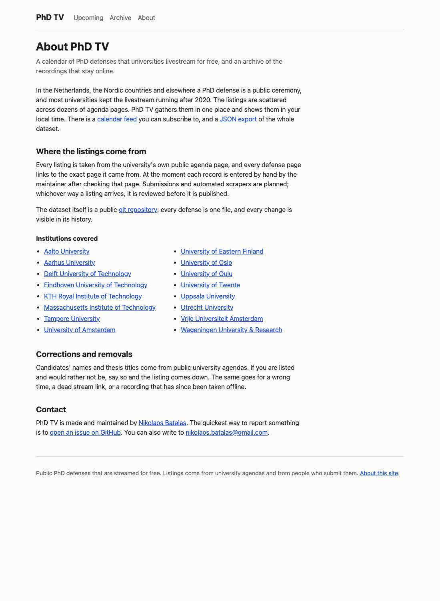

## What changed

The site has a third page. `/about/` says what PhD TV is, where its listings come from, how to get a wrong or unwanted listing corrected or removed, and how to reach the person behind it. The navigation gained an "About" entry and the footer a link to the same page.

The user asked for two things: the page should list where the site gets its information from, and how the creator can be contacted. The second needed a decision only they could make, so the session stopped to ask: GitHub issues, the Gmail address, or both, and whether to use the full name. The answer was both channels and the full name, so the contact section links Nikolaos Batalas to the GitHub profile, points at the issue tracker as the quickest route, and gives the email as a plain `mailto:` link. Obfuscating the address was offered and declined; it breaks copy-paste and does little against modern scrapers anyway.

## How it works

The interesting design choice is that the list of institutions is not written into the page. `loadSiteData` already reads every file under `universities/` to resolve the records' university slugs; it now also returns that registry sorted by name, and the generator hands it to the new page function. `AboutPage` renders one list item per institution, linked to its `agenda_url`, falling back to `website` when there is no agenda URL and to plain text when there is neither. Adding a university to the registry adds it to the about page on the next build; nobody has to remember to edit prose.

The page is server-rendered React with no island. It is the first page on the site with no client script, and `pageAssets` with an empty island list handles that without special casing: just the stylesheet.

The rest is deliberately small so that it merges cleanly with the redesign under way in the sibling worktree: one nav line and one footer line in `Shell`, one `aboutPage` function in `pages.tsx`, one `files.push` in `generate.ts`, and a `.prose` block appended to the end of the stylesheet that uses no colour tokens, so it survives the token rename the redesign brings.

Tests came first at each layer: the data loader (sixteen institutions, sorted, with their agenda URLs), the component (maintainer links, the three link fallbacks for institutions, base-prefixed feed and export links), the page function (title, description, no `<script>`), the generator (the file exists and links a real agenda), and the shell (both about links under a base path). 185 tests pass, the type check is clean, and the page was built and screenshotted through the real dev server on a spare port.

## What's next

This branch (`worktree-about-page`) is not merged yet. The calendar-views worktree has uncommitted rewrites of `Shell`, `PageIntro`, `pages.tsx` and the stylesheet; whichever lands second resolves a one-line conflict in each of the nav, the page functions and the end of the stylesheet.

## Surprises

Mid-session the user reported that `npm run dev` showed an old version of the site. It was serving exactly what it should: the running server's working directory was the primary checkout on `main`, while the work they wanted to see lived in a worktree. `scripts/dev.ts` builds and serves its own checkout's `dist/` and watches only that checkout, so with three sessions in three worktrees, each needs its own server on its own port. The user also said the dev server should not be serving `dist/` at all; that is how it is written today and is a separate change if wanted.

The Claude Code worktree guard refused several Bash commands in this session as "too complex to verify": heredocs, an `env -u` prefix, and a quoted path to Chrome. The workarounds were the Write and Edit tools for files and a two-line shell wrapper in the scratchpad for headless Chrome.
