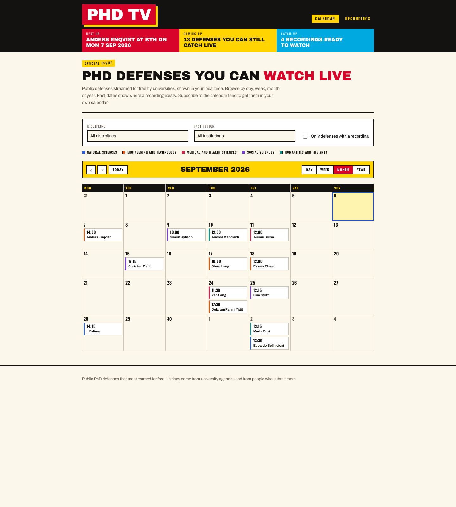
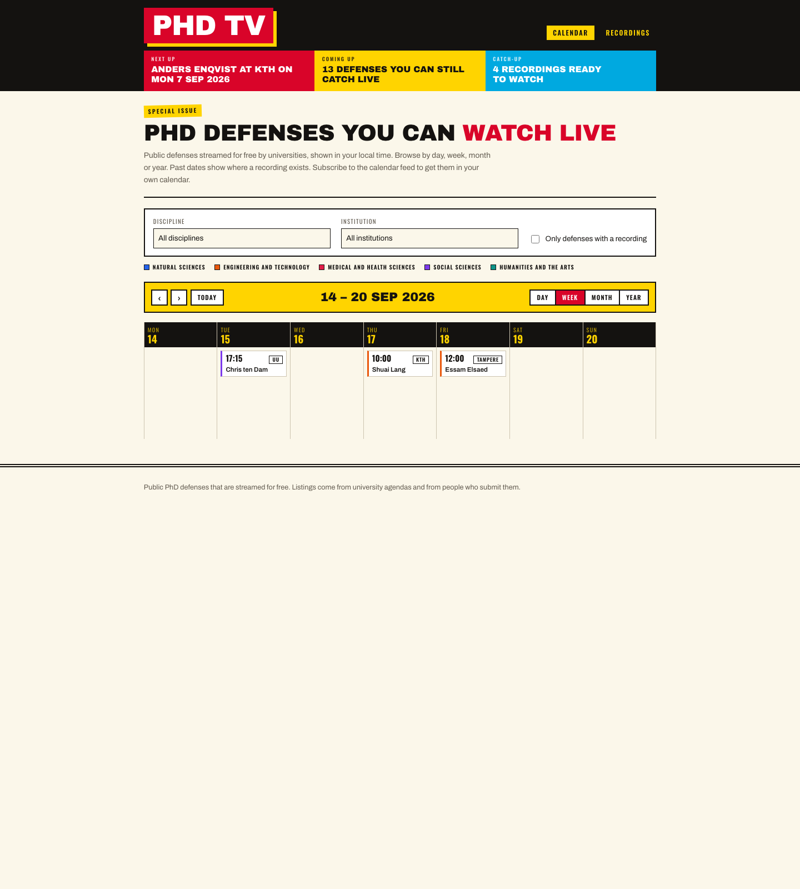
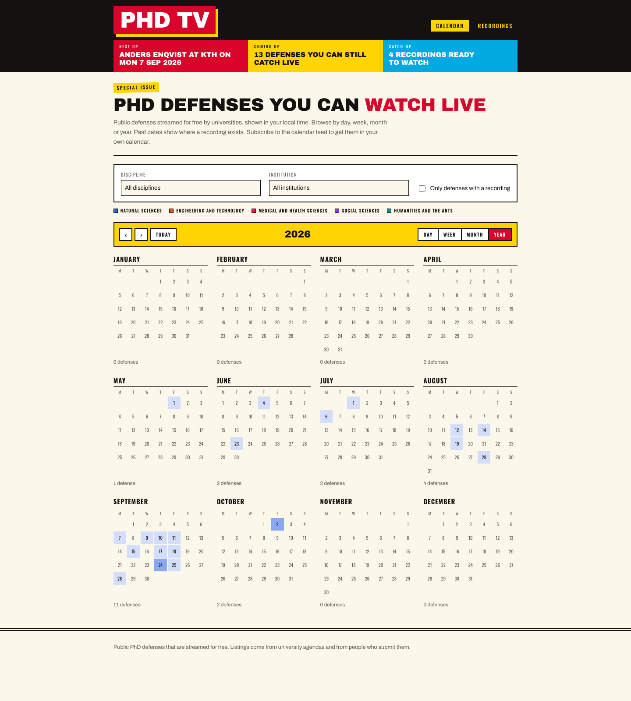
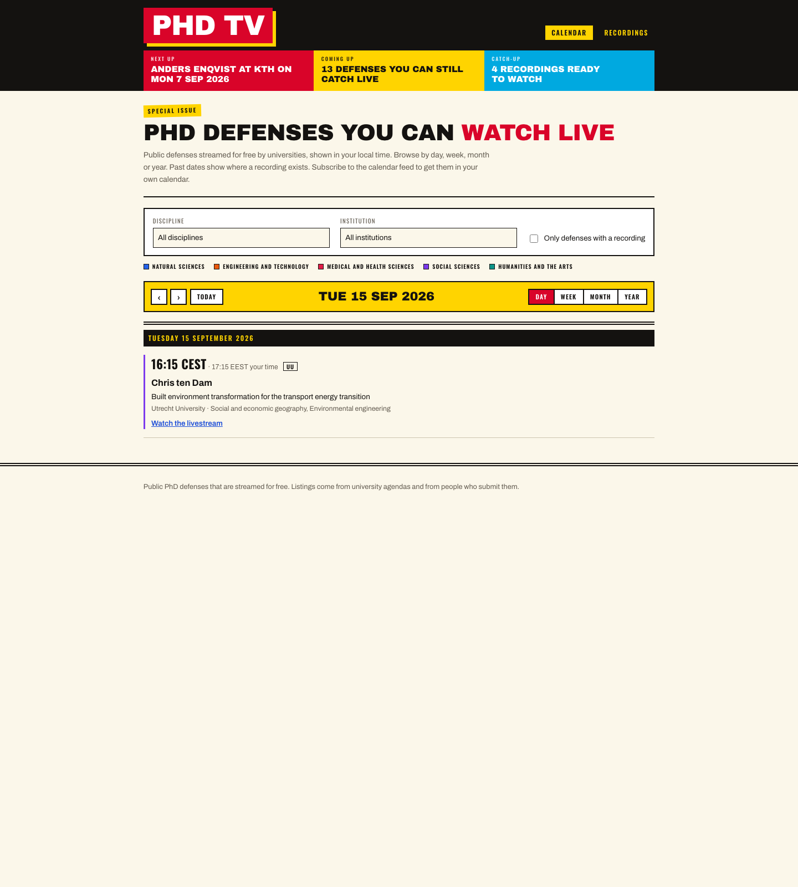
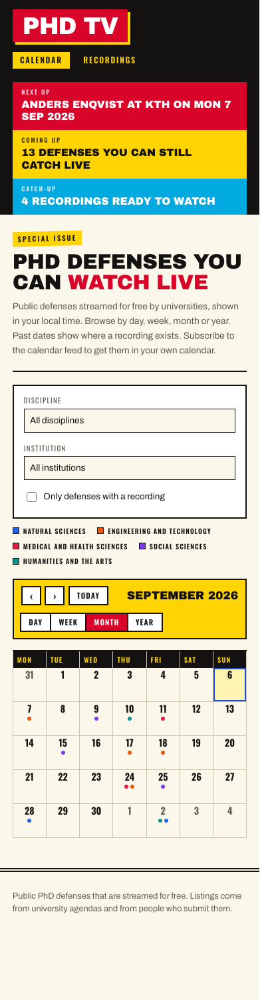

## What changed

The list is gone. `src/components/DefenseSchedule.tsx` and the separate `/archive/` page were deleted, and the home page is now `src/components/DefenseCalendar.tsx`: a headline strip, the page intro, the filters, the major-field legend, a live strip, and one of four calendar views. Under `src/` and `test/` that is 50 files, about 1,950 lines added and 410 removed against `main`, and 237 tests pass.

The new pieces, roughly in the order they were built:

| File | What it does |
| --- | --- |
| `src/lib/calendar.ts` (238 lines) | Every date helper, pure, on `YYYY-MM-DD` strings: `addDays`, `startOfWeek`, `weeksOfMonth`, `periodBounds`, `groupByDate`, `nearestDate`, and the URL codec `calendarFromSearch` / `searchFromState`. |
| `DayView`, `WeekView`, `MonthView`, `YearView` | One component per view. The week is seven columns of stacked chips; the month is five or six rows of cells with a chip each; the year is twelve mini-months with day cells shaded on a four-step scale. |
| `DefenseChip`, `MajorFieldLegend` | The chip carries a 3px left stripe in its discipline's OECD major-field colour; the legend names the six. |
| `CalendarToolbar`, `EmptyPeriod` | Previous / next / Today, the period label, the view switcher; and, when a period is empty, the box that links straight to the nearest defense in either direction. |
| `HeadlineStrip` | The three-colour band under the masthead: "On air now" or "Next up" in red, "Coming up" in yellow, "Catch-up" in cyan. |
| `src/styles/global.css` (about 260 lines after the rewrite) | The look, which was most of the work. |

The defense page kept its structure but picked up the institution badge above the candidate, the `pill-live` "Live now" pill, and a "University announcement" link to `source.url` whenever the record has one. The README's "Using the site" section was rewritten around the calendar rather than the list-plus-archive it used to describe.

Here is the month view as the build actually renders it:

The week, seven columns of chips rather than a time grid:

The year, which is the view that answers "how busy is this project, really":

The day, under a double rule:

And the phone, where the month collapses to dots:

## Why it matters

The list could only answer "what is next". The calendar answers "what is next", "how busy is October" and "what did I miss in June" from one screen, and it does it at four scales, which is the point: with 22 records across six months, density is the interesting fact and a list hides it. The year view above makes the shape of the dataset legible in one glance — eleven defenses in September, two in October, nothing yet in November.

The archive dissolving into a filter is the other half. A calendar that could only move forward would be strange, and "is there a recording" is just what a past cell shows. `/archive/` is now a meta-refresh page pointing at `/?view=year&recorded=1`, so old links land on the same information in the new shape.

The filters matter more than they did too. Discipline, institution and recordings-only now apply *before* anything is counted or laid out, so the year view's per-month counts, the empty-period jump links and the headline strip's "13 defenses you can still catch live" all describe the filtered listing rather than the raw one. Narrowing to one discipline rewrites the whole page, not just a sublist.

## How it works

**Dates are strings.** `src/lib/calendar.ts` works on `YYYY-MM-DD` throughout — `addDays` parses, adds, and reformats; `weeksOfMonth` returns arrays of those strings. No `Date` arithmetic, no date library, no DST edge cases in the grid code, and the helpers are trivially testable (`test/lib/calendar.test.ts` is 156 lines of them). The single zone-aware step in the whole feature is `localDateString`, an `Intl.DateTimeFormat('en-CA')` call that turns an instant plus a zone into one of those strings.

**The zone hand-over.** In a grid the time zone stops being a label and becomes a placement decision: a 00:30 Amsterdam defense sits on the previous day in New York. At build time there is no viewer, so `groupByDate(defenses, null)` puts each defense on its institution-local date — the date already in the record's filename — and the static page agrees with the calendar feeds. `todayIn('UTC', now)` picks the build's today. After hydration an effect hands over: `groupByDate(defenses, viewerZone)` regroups, today becomes the viewer's today, and chips show viewer time. First render matches the server exactly, so hydration is clean; the second render is the correct one.

**State lives in the URL.** `view`, `date`, `discipline`, `university` and `recorded` are read from `location.search` on mount and written back with `replaceState` on every change, and `searchFromState` omits anything at its default so the common URL stays `/`. A link therefore reopens the same screen — including the archive redirect's `?view=year&recorded=1`.

**The look is CSS, not components.** The TV-guide system — newsprint cream, rich black, warm red, process yellow and cyan; hard corners; borders instead of whitespace; a red masthead box with a 6px hard yellow offset — is about 260 lines of tokens and rules. The three typefaces are self-hosted from `@fontsource/archivo-black`, `@fontsource/oswald` and `@fontsource/archivo`, imported at the top of `global.css` so Vite bundles the woff2 files with hashed names. The site makes no request to Google Fonts.

## What's next

The spec's out-of-scope list is the backlog, and nothing on it moved: popovers, colour by country, keyboard shortcuts, remembering the last view, a history entry per navigation, a time-grid week, a second taxonomy level in the filters, and a light/dark toggle button (the site still follows the system preference). The "centerfold" pages per thesis — portraits, pull quotes, questions and facts — are being built by a sibling session on its own worktree, against a `.tag-centerfold` hook and a precomputed-headline strip that this branch reserved for them.

The nearer thing is data. The year view above is mostly white space, and the empty-period jump links exist precisely because paging through blank months is the normal experience today. The calendar makes the case for the scraper better than any argument could.

The final review also asked for two accessibility fixes (contrast on the cyan and dark-red panels, an outline instead of a box-shadow ring for today) and island-level tests for the institution and recordings filters; they landed before the merge.

## Surprises

**Port 4321 was taken, twice.** The visual check needed a dev server, and both `4321` and the fallback `4399` already had one listening — the main checkout and the sibling centerfold worktree, both running `node scripts/dev.ts`. Two parallel sessions on one machine is a configuration nobody designed for, and the failure mode is quiet: the first `curl` returned `200` from *someone else's* build, which would have produced a visual check of the wrong branch. Checking `lsof -a -p <pid> -d cwd` for each listener before trusting a port is now the habit.

**The live strip could not be photographed.** Every screenshot above is of the real build with real records, and none of them shows the live strip or its "On air!" starburst, because no seeded defense is in progress at the actual current instant and the strip is computed from the viewer's clock. Component tests cover it, but "the tests pass" is not a visual check. The way through was to fetch the built page over HTTP, splice a nine-line classic `<script>` that replaces `window.Date` with a frozen one into its `<head>` — classic scripts run before the deferred module bundle, so the island never sees the real clock — write the result back into `dist/` and screenshot that. Frozen at 2026-09-07T11:15Z the strip appears exactly as designed: red 2px border, "LIVE NOW" bar, the yellow starburst rotated over the corner, and the headline strip flipping from "Next up" to "On air now: Anders Enqvist defends at KTH!".

**Nothing needed fixing.** The rendered views were compared against the third-round Claude Design renders in `blog/media/2026-09-06-01-calendar-views-designed/` and matched them structurally with no CSS changes at all — same bars, same rules, same starburst placement, same shading scale, same six-row mini-months with aligned captions. After a day where the styling was rebuilt mid-plan around a look the user found on their own, a clean visual check was the least likely outcome.
