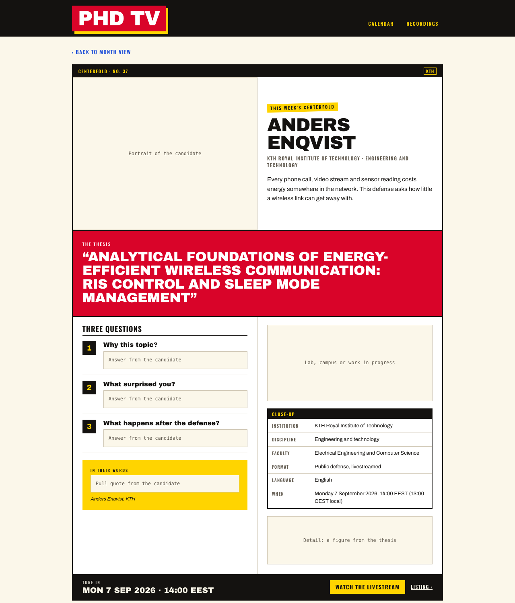
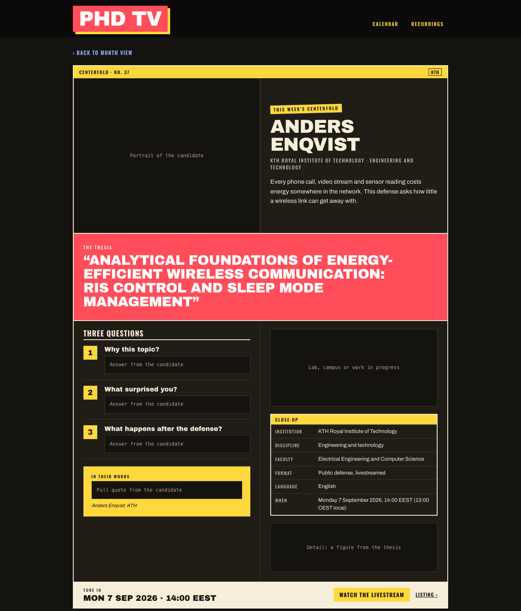
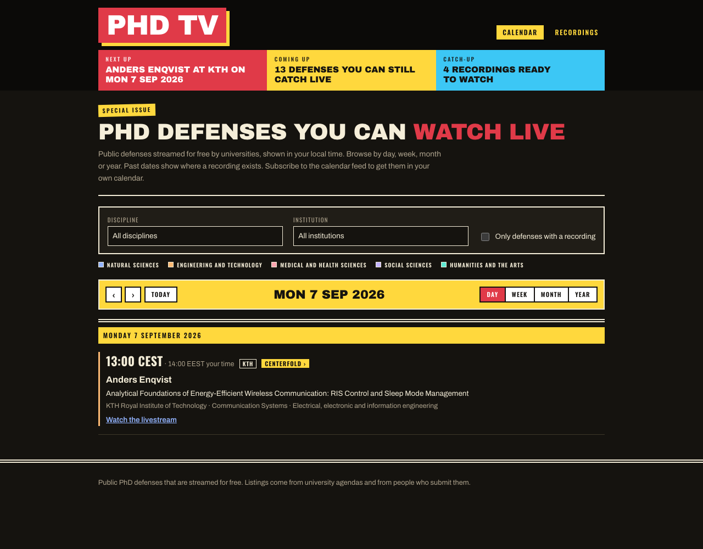
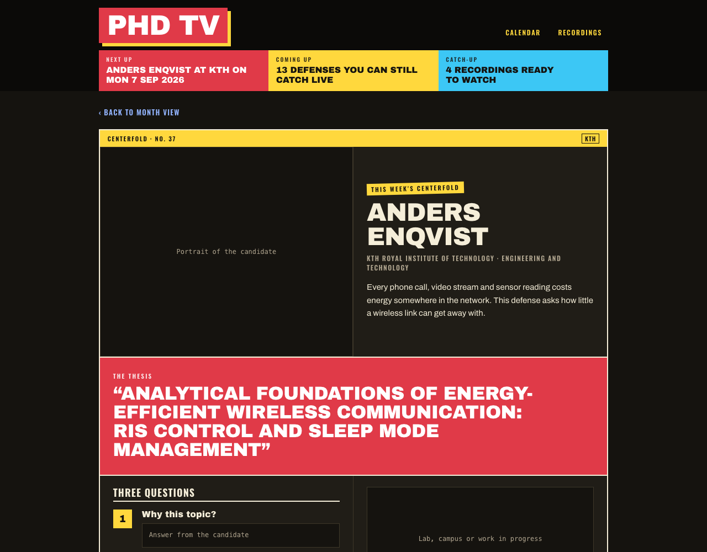

## What changed

The user handed over a Claude Design brief for a "Centerfold": a magazine-style feature page for one defense, with the candidate's name set large, the thesis title as a red banner, a portrait and two more photos, three questions, a pull quote, a "Close-up" facts box and a "Tune in" bar that leads to the stream or the recording. Only some defenses get one. It is in on the `centerfold` branch, in the site's own stack:

- `records/` gain an optional `centerfold` block (issue, kicker, standfirst, portrait, wide and detail images, quote, questions, facts). Every field is editorial and may be empty. The JSON schema is regenerated.
- The view model carries the block with image paths resolved under the site base, and, at the user's request mid-session, presents the centerfold as the defense's page: `Defense.url` points at `/centerfold/<id>/` when the block exists, and a new `listingUrl` keeps the plain page reachable. Chips, cards, the calendar feeds and the JSON export follow `url` without knowing the rule.
- `CenterfoldPage` is a third hydrated island with its own stylesheet, `centerfold.css`, bundled from the island's client entry so only that page loads it. The phase, the times and the back link follow the viewer after mount.
- A `preview` build option, on for the dev server and for `SITE_PREVIEW=1`, renders a labelled slot for each empty editorial field; the deploy hides the block instead. Anders Enqvist and Shayne Longpre carry the two sample centerfolds from the prototype.
- A yellow "Centerfold ›" tag on the listing page and on the calendar cards, after the live pill.

Fifty-one tests were added across the schema, the view model, the helpers, the component, the page functions and the build. The suite stands at 256 plus the real-build test.

## Why it matters

The calendar answers "when"; a centerfold answers "why would I watch this one". It is the first page on the site with editorial voice, and the data model has to let an editor lay the page out before the copy and the photos exist, which is what the preview slots are for. Making the centerfold the presented page, rather than an extra page hanging off the listing, means a curated defense reaches visitors through every existing path, including calendar subscriptions, without a second link to maintain.

The bigger structural point is how it was built. The calendar views were being implemented by another session in a sibling worktree, from a plan whose stylesheet encoded an earlier design round. The brief assumed the newer "Design10" look (Oswald and Archivo Black, cream page, black, warm red, process yellow) was already the site's. It was not, and nobody had told the calendar plan. The first thing this session did was write that finding into the other session's plan file; the calendar session answered by message, proposed a split, and both branches converged on the same token and class names before either had committed a stylesheet.

## How it works

**The split.** The calendar branch owns the shared styling layer: fonts, tokens, `global.css`, the masthead, the page intro, the headline strip. The centerfold branch owns its schema fields, its helpers, its component, its page function, its stylesheet and its tags, and rebases onto the calendar branch when told. The centerfold stylesheet uses only the agreed token names (`--page`, `--ink`, `--live`, `--yellow`, `--bar`, `--bar-fg`, the three font stacks) and the shared `.column`, `.badge-inst`, `.pill-live` and `.tag-centerfold` classes; the last of these the calendar session added on request, because the listing page and the cards never load the centerfold stylesheet. After the calendar branch's Task 3 landed, the rebase applied without a conflict.

**Island-scoped CSS.** Vite lists a stylesheet imported from a client entry under that entry's `css` in the manifest, and `pageAssets` already adds those files to a page. So `src/site/client/centerfold.tsx` imports `centerfold.css`, and the centerfold page gets a second stylesheet link that no other page carries, with no change to the global one.

**Preview versus production.** `generate()` takes a `preview` flag that reaches the island as a prop. In production the component filters questions to the answered ones, drops the section when none remain, and omits images, the kicker, the standfirst and the quote box when they are empty. In preview it renders the standard three questions with "Answer from the candidate" slots and a labelled box for each missing field, so the layout can be judged with nothing written yet.

**The back link.** The server renders "Back to month view" pointing at the home page. After mount the component reads `document.referrer`: if it is the calendar page on the same origin, the link becomes "Back to week view" (or whichever `view` the referrer's query names) and points back at that exact URL, filters and date included; failing that, a `from` query parameter on the centerfold URL names the view; failing that, the month view stays. The first client render matches the server markup, so hydration is silent.

**Times.** The tune-in bar and the "When" row show the institution's date and time at build time and the viewer's after mount, with the institution's in brackets when the zones differ. The renders above were taken from a machine in Athens, hence "14:00 EEST (13:00 CEST local)".

## What's next

- Done later the same evening, once the calendar branch was complete: the final rebase (four conflicting files, all resolved by keeping the calendar branch's rewrites and re-adding the tag after the pill), and the headline strip rendered statically on the centerfold page from headlines computed once per build, which completes the "masthead + blurb strip" the brief describes. The two devlog entries had both taken index 02; the calendar entry, the later one, became 03.
- The editorial content: answers, pull quotes and photos for the two sample centerfolds, and a `public/img/` directory to serve them from.
- Merging: `calendar-views` first, then `centerfold`.

## Surprises

The most consequential discovery had nothing to do with the centerfold: the calendar plan's stylesheet was already superseded by the design it was about to implement. Ten minutes later the two sessions were exchanging messages and had settled ownership of every shared file. The other session also caught this one writing into its worktree and asked, politely, for messages instead; fair.

React's server renderer inserts `<!-- -->` between adjacent text nodes, so a label written as three JSX pieces never matches the plain string a test expects in the HTML. The fix is a template string, and it is worth knowing before writing any assertion on server output.

Two test-environment details bit once each: the after-mount clock is the real clock, so a "past" fixture dated December turned upcoming in September until `Date` was faked; and the viewer zone is the machine's, so the file pins `process.env.TZ`. And headless Chrome will not run through a symlink, since it resolves its framework relative to the executable's path; a two-line wrapper script does the job.
