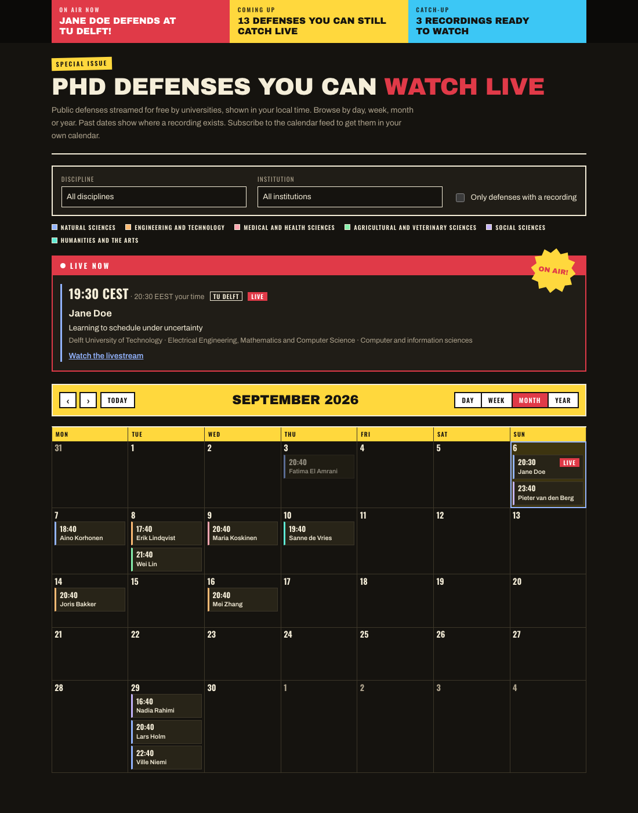
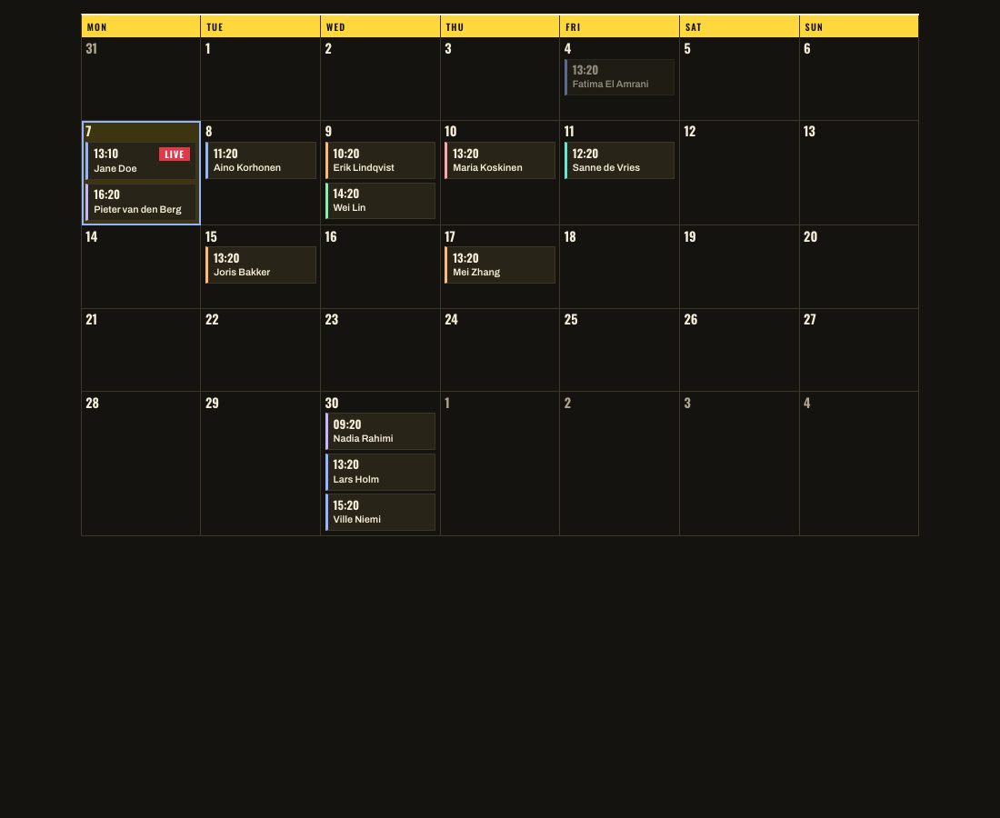

## What changed

The repository has a Storybook. `npm run storybook` opens it on port 6006; `npm run build-storybook` writes it as a static site. Every file in `src/components/` has a matching `stories/<Component>.stories.tsx`, 84 stories over 19 components, and `test/stories/stories.test.tsx` renders each one under jsdom as part of `npm test`, so the suite went from 237 tests to 382.

The setup is as small as Storybook lets it be: the `storybook` and `@storybook/react-vite` packages at 10.6, a `.storybook/main.ts` naming the framework and the stories glob, and a `.storybook/preview.ts` whose only content is an import of `src/styles/global.css`. There is still no `vite.config.ts`; Storybook runs on Vite's defaults exactly as the site build does, and Vite 8 transforms the JSX on its own, so there is no React plugin either. No docs addon: controls, actions and viewports are in Storybook's core since version 9.

Here is the home-page island as Storybook renders it, in dark mode because that is what the machine that took the screenshot prefers:



## Why it matters

Until today the only way to see a component in a state was to find or fabricate a record that produced it and rebuild the site. A live defense could only be seen when one was live. The archive states, the empty periods, the centerfold with nothing written yet, the chip in each of the six field colours: each of those is now one click. The design work of the last two days was done against Claude Design renders and headless-Chrome screenshots of the whole build; the next round can be done against the component alone.

The test is the part that keeps this true. The coverage assertion reads `src/components/` and compares it with `stories/`, so the next component added to the site fails `npm test` until it has stories, and a story that stops rendering after a refactor fails the same way. Storybook that is not kept up is worse than none; this one cannot drift silently.

## How it works

Stories live in `stories/` beside `test/`, not next to the components, matching how this repository already separates tests from source. They import the same `fixtureDefense` and `startingAt` helpers as the tests, so a schema change reaches the stories through the fixture. Shared story data sits in `stories/support.tsx`: the six OECD major fields, six institutions, a centerfold with every editorial field written, and `sampleDefenses(now)`, twenty fictional defenses spread around a given instant, with one in progress, a busy day three weeks out, and a past that covers every recording state.

There are two clocks. Components that take `now` as a prop, such as `DefenseCard` and the four calendar views, get `PINNED_NOW`, Monday 7 September 2026 at 13:20 in Amsterdam, and a fixed viewer zone, so their stories are the same every time. Components that read the viewer's clock after they mount, `DefensePage`, `DefenseCalendar` and `CenterfoldPage`, get their defenses placed relative to `new Date()` when the story module loads, so their live stories are live when you open them. They go stale after an hour or so; a reload resets them.

The pinned clock is what makes a story like the month view worth looking at twice: Monday the 7th is outlined as today with a live chip at 13:10, the 4th holds a dimmed past chip, and the 30th is the busy day with three.



The test composes each story with Storybook's portable-stories API and mounts it with Testing Library:

```tsx
const modules = import.meta.glob<StoryModule>('../../stories/*.stories.tsx', { eager: true });

it('exist for every component in src/components', () => {
  expect(storyFiles.map(componentName)).toEqual(components);
});

for (const [name, Story] of Object.entries(composeStories(module))) {
  it(`renders ${name}`, () => {
    const { container } = render(<Story />);
    expect(container.firstElementChild).not.toBeNull();
  });
}
```

That first assertion was written before any story existed, and it failed the way it should:

```
- [ "AboutPage", "DefenseCard", "DefensePage", "DefenseSchedule", "FilterBar",
-   "PageIntro", "RecordingStatus", "Shell", "TimeLabel" ]
+ []
```

The centerfold stories import `src/styles/centerfold.css` themselves, since on the site only that island loads it. The photographs do not exist yet anywhere, so the stories draw them as inline SVG data URIs. The preview variant, which the deployed site never shows, is the state an editor will be looking at most:


## Surprises

The branch was built against a `main` that had nine components. While the first nine stories files were being written and checked, the calendar-views and centerfold branches were merged into `main` by the sibling sessions, deleting `DefenseSchedule`, adding eleven components and rewriting the stylesheet. The checkpoint commit was rebased onto the new `main` (the only conflict was `package-lock.json`, resolved by taking `main`'s copy and reinstalling), the test then reported exactly what was missing, and the rest of the evening went into the eleven new stories files. That the coverage test fails loudly when the component set changes turned out to be useful before the branch was even merged.

Two smaller ones. The native worktree tool branches from `origin/main`, which was ten commits behind the local `main`; the worktree had to be made with `git worktree add` and entered by path. And headless Chrome, which had captured ten stories perfectly one at a time, produced Storybook's own error page ("Failed to fetch dynamically imported module") for most of them when run fifteen at a time against Python's `http.server`; the PNGs were plausible sizes, and only opening them showed the problem.

## What's next

- Merged into `main` the same evening as a fast-forward, with the suite green on the merged checkout. Nothing in it touches the site build; `main` is still unpushed.

> **Update 2026-09-06**: pushed and deployed later the same evening with the rest of the day's work; see [the integration entry](2026-09-06-06-integration-and-deploy.md).
- Stories for the calendar island cannot open in the week, day or year view from the sidebar, because the island reads its view from the page URL; the toolbar inside the story works. A story per view would need the island to accept an initial state, which is a change to the component, not the stories.
- There is no dark-mode toggle in the toolbar; the stylesheet follows `prefers-color-scheme`, so the operating system decides. A toggle would mean duplicating the dark tokens under a class, which is not worth it yet.
- Storybook's Vitest addon, which would run the stories in a real browser, was left out on purpose. The jsdom render catches a story that throws; it does not see layout.
